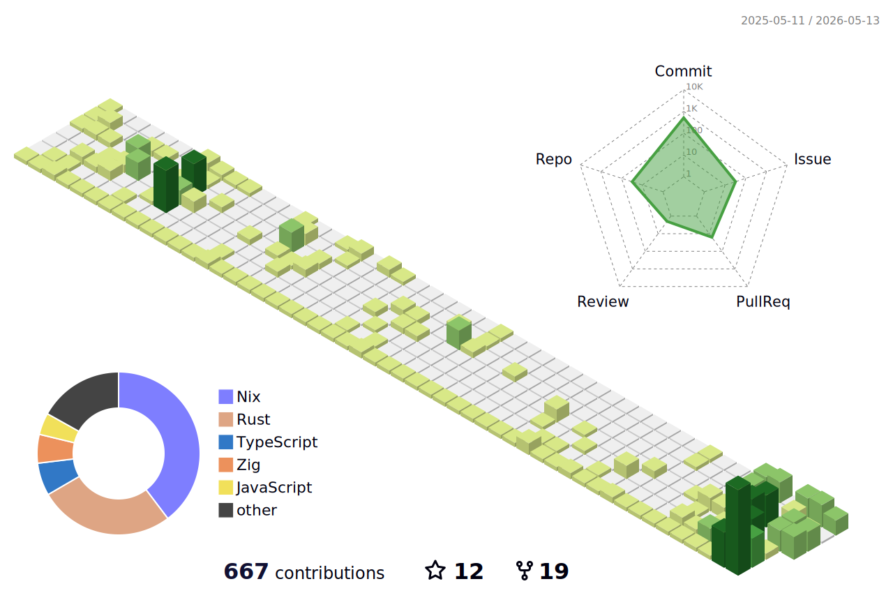
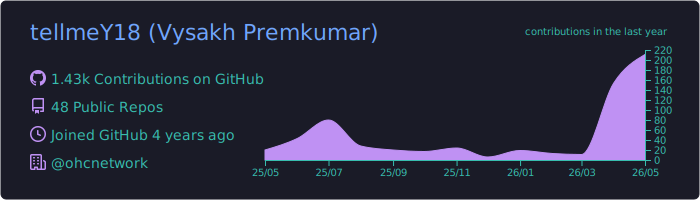
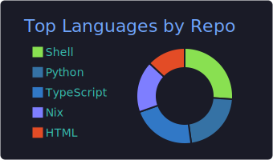
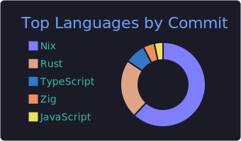
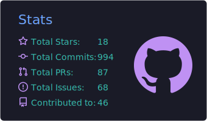
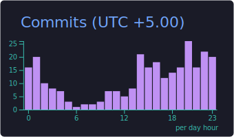

<!-- ═══════════════════════════════════════════════════════════════════════ -->
<!--  👋  Hey there, I'm Vysakh  ( aka  y__h  /  tellmeY18 )                 -->
<!--  This README is auto-generated by a fleet of GitHub Actions 🤖          -->
<!--  Peek inside .github/workflows/ to see how the sausage is made.         -->
<!-- ═══════════════════════════════════════════════════════════════════════ -->

<div align="center">

<!-- 🌌 Hero banner -->
<a href="https://github.com/tellmeY18">
  
</a>

<!-- ⌨️ Typing intro -->
<a href="https://git.io/typing-svg">
  
</a>

<br/>

<!-- 🪪 Profile badges -->
<a href="https://github.com/tellmeY18?tab=followers">
  
</a>
<a href="https://github.com/tellmeY18?tab=repositories">
  
</a>


</div>

---

## 🧑‍💻  `whoami`

```bash
$ cat ~/.about
╭──────────────────────────────────────────────────────────────────────╮
│  🧑   Name       :  Vysakh  ( y__h / tellmeY18 )                     │
│  🖥️   Daily      :  macOS + nix-darwin                               │
│  🐧   Also runs  :  NixOS · Android · Symbian (Delight custom FW)    │
│  🔭   Currently  :  Self-hosting, NixOS flakes, building FOSS tools  │
│  🌱   Learning   :  Systems programming · SRE · Nix                  │
│  🦄   Philosophy :  Free Software, forever                           │
│  📫   Reach me   :  open an issue — I reply!                         │
╰──────────────────────────────────────────────────────────────────────╯
```

---

## 🧰  Tech Stack & Tools

<div align="center">

### 🖥️  OS & Shells


### 💻  Languages


### 🛠️  Dev & DevOps


</div>

---

## 📊  GitHub in numbers

<div align="center">

<!-- Stats + streak -->
<a href="https://github.com/tellmeY18">
  
  
</a>

<br/>

<!-- Top langs + trophies -->
<a href="https://github.com/tellmeY18">
  
</a>

<br/><br/>

<a href="https://github.com/ryo-ma/github-profile-trophy">
  
</a>

</div>

---

## 📈  Contribution activity

<div align="center">

<a href="https://github.com/ashutosh00710/github-readme-activity-graph">
  
</a>

</div>

---

## 🐍  Watch my contributions get eaten

<div align="center">

<picture>
  <source media="(prefers-color-scheme: dark)"
          srcset="https://raw.githubusercontent.com/tellmeY18/tellmeY18/output/github-snake-dark.svg" />
  <source media="(prefers-color-scheme: light)"
          srcset="https://raw.githubusercontent.com/tellmeY18/tellmeY18/output/github-snake.svg" />
  
</picture>

</div>

---

## 🏙️  3D contribution skyline

<div align="center">

<picture>
  <source media="(prefers-color-scheme: dark)"  srcset="./profile-3d-contrib/profile-night-rainbow.svg" />
  <source media="(prefers-color-scheme: light)" srcset="./profile-3d-contrib/profile-green-animate.svg" />
  
</picture>

</div>

---

## 🎴  Profile summary cards

<div align="center">



<br/>




<br/>




</div>

---

## 🤖  Full metrics dashboard

<div align="center">



</div>

<details>
<summary>📦 <b>More metrics cards</b> (click to expand)</summary>

<div align="center">


</div>

</details>

---

## 🏅  Holopin badges

<div align="center">

[](https://holopin.io/@y__h)

</div>

---

<div align="center">

### 💬  `echo "thanks for stopping by!"`

> 🦄 **Free Software. Forever.** — if it runs on my machine, it runs on yours too.


</div>
